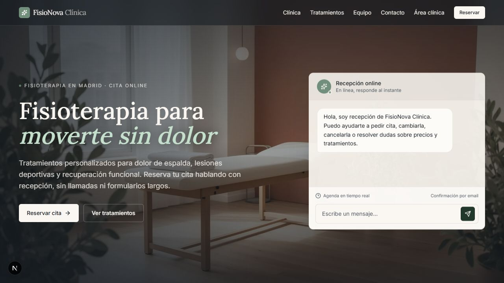

# FisioNova Clinica, recepcionista IA para fisioterapia

[](https://proyecto-ia-recepcionista.vercel.app/)


Demo publica para portfolio tecnico: una web app de una clinica de fisioterapia ficticia con recepcionista IA, solicitud de citas, agenda privada para el medico y confirmaciones por email.

**Demo online:** [https://proyecto-ia-recepcionista.vercel.app/](https://proyecto-ia-recepcionista.vercel.app/)



> FisioNova Clinica no es una clinica real. Es un proyecto de portfolio para demostrar producto, UX, frontend, backend ligero e integracion con IA. El chat incluye una barrera de seguridad: ante urgencias, diagnosticos, medicacion o sintomas serios, informa de que es una demo ficticia y deriva a urgencias o a un profesional sanitario real.

## Que demuestra

- Landing completa de una clinica local ficticia, con hero visual, tratamientos, equipo, contacto, FAQ y politica de cookies.
- Chat con Virgi, recepcionista IA, integrado en la web y ampliable en modal.
- Integracion opcional con OpenAI para interpretar mensajes y proponer huecos.
- Flujo seguro de citas: la IA no confirma citas finales, crea una solicitud pendiente.
- Panel privado `/medico` protegido por PIN.
- Calendario operativo tipo agenda, con click en citas, ficha del paciente, acciones y movimiento por drag and drop.
- Emails transaccionales con Resend solo desde el panel privado.
- Modo demo sin base de datos, mas opcion Supabase para persistencia real.
- SEO tecnico: metadata, sitemap, robots, manifest, Open Graph, JSON-LD y `llms.txt`.
- Verificacion con TypeScript, ESLint, Prettier, Vitest, build y audit.

## Stack

- Next.js 16, App Router y React 19.
- TypeScript estricto.
- Tailwind CSS 4.
- Componentes estilo shadcn con `Button` y utilidad `cn()`.
- Zod para validar variables de entorno y payloads.
- OpenAI Responses API para la recepcionista.
- Resend para emails de confirmacion, cancelacion y cambios.
- Supabase opcional para guardar citas en produccion.
- Vitest, Testing Library, ESLint y Prettier.

## Flujo de cita

1. El paciente habla con Virgi.
2. Si no cuenta que le duele, Virgi pregunta antes de mostrar huecos.
3. Si detecta el motivo, asigna tratamiento: general, deportiva o postural.
4. La web muestra huecos disponibles.
5. El paciente deja sus datos.
6. Se crea una cita `pending`.
7. El medico entra en `/medico`, revisa el calendario y confirma, mueve o cancela.
8. Solo al confirmar/cambiar/cancelar desde el panel privado se llama a `/api/email`.

## Seguridad y limites actuales

Incluido:

- `.env*` ignorado por Git, excepto `.env.example`.
- Validacion centralizada de env vars en `src/lib/env.ts`.
- OpenAI y Resend solo se usan desde rutas server-side.
- `/api/appointments` protege lectura y cambios con `DOCTOR_DASHBOARD_PIN`.
- `/api/email` protege el envio con `DOCTOR_DASHBOARD_PIN`.
- Rate limit ligero en memoria para `/api/receptionist` y POST publico de `/api/appointments`.
- Limites de longitud en mensajes, datos de paciente y payloads de email.
- Headers de seguridad en `next.config.ts`.
- `/medico` tiene `noindex` y `robots.ts` bloquea `/api/` y `/medico`.
- JSON-LD se serializa escapando `<`.

Pendiente para produccion real:

- Cambiar `DOCTOR_DASHBOARD_PIN`, no usar `1234`.
- Activar Supabase si quieres persistencia real de citas.
- Configurar reglas/RLS y backups si se usa Supabase.
- Anadir proteccion perimetral real si el proyecto recibe trafico: Vercel Firewall, WAF, Turnstile, captcha o rate limit persistente.
- Rotar cualquier API key que se haya pegado en chats, capturas o commits.
- Revisar textos legales con un profesional si se va a usar comercialmente.

## Arranque local

```bash
npm install
cp .env.example .env.local
npm run dev
```

Abre `http://localhost:3000`.

Panel privado local:

```text
http://localhost:3000/medico
PIN demo: 1234
```

## Variables de entorno

Copia `.env.example` a `.env.local` y rellena solo lo necesario.

```env
NEXT_PUBLIC_APP_URL=http://localhost:3000

# OpenAI opcional
OPENAI_API_KEY=
OPENAI_MODEL=gpt-5.4-nano

# Supabase opcional
NEXT_PUBLIC_SUPABASE_URL=
NEXT_PUBLIC_SUPABASE_ANON_KEY=
SUPABASE_SERVICE_ROLE_KEY=

# Panel privado
DOCTOR_DASHBOARD_PIN=1234

# Resend opcional
RESEND_API_KEY=
RESEND_FROM_EMAIL=onboarding@resend.dev
```

Sin `OPENAI_API_KEY`, se usa fallback local basado en reglas. Sin `SUPABASE_SERVICE_ROLE_KEY`, las citas viven en memoria durante la sesion del servidor. Sin `RESEND_API_KEY`, los emails se simulan.

## Despliegue en Vercel

1. Importa el repositorio en Vercel.
2. Configura como minimo:
   - `NEXT_PUBLIC_APP_URL=https://tu-dominio.vercel.app`
   - `DOCTOR_DASHBOARD_PIN=un-pin-largo-no-obvio`
3. Para IA real:
   - `OPENAI_API_KEY`
   - `OPENAI_MODEL=gpt-5.4-nano` o el modelo gratuito/disponible que quieras probar.
4. Para emails reales:
   - `RESEND_API_KEY`
   - `RESEND_FROM_EMAIL`
5. Para persistencia real:
   - `NEXT_PUBLIC_SUPABASE_URL`
   - `NEXT_PUBLIC_SUPABASE_ANON_KEY`
   - `SUPABASE_SERVICE_ROLE_KEY`
   - Ejecuta `supabase/appointments.sql` en tu proyecto Supabase.
6. Ejecuta antes:

```bash
npm run verify
```

## Scripts

```bash
npm run dev              # servidor local
npm run build            # build de produccion
npm run start            # servir build
npm run lint             # ESLint
npm run check            # TypeScript sin emitir
npm run format           # formatear con Prettier
npm run format:check     # comprobar formato
npm test                 # tests unitarios
npm run audit            # npm audit high+
npm run verify           # formato, lint, tipos, tests, build y audit
npm run design:audit     # auditoria visual con Impeccable
```

## Estructura principal

```text
src/
  app/
    api/appointments/     # citas, agenda privada y acciones
    api/email/            # emails protegidos por PIN
    api/receptionist/     # chat IA y fallback local
    medico/               # panel privado
  components/
    receptionist/         # landing, chat, calendario y panel medico
    legal/                # cookies
    seo/                  # JSON-LD
    ui/                   # componentes base
  lib/
    receptionist/         # agenda, datos demo, emails y store
    env.ts                # validacion de entorno
    rate-limit.ts         # rate limit demo en memoria
supabase/
  appointments.sql        # esquema opcional
```

## Licencia

Este proyecto esta publicado bajo Creative Commons Attribution-NonCommercial 4.0 International (`CC-BY-NC-4.0`).

Puedes estudiar, compartir y adaptar el codigo con atribucion, pero no puedes usarlo con fines comerciales, revenderlo, desplegarlo para un cliente, ofrecerlo como SaaS, white-label o integrarlo en un producto/servicio de pago sin permiso escrito del autor.

Ver [LICENSE](LICENSE).
